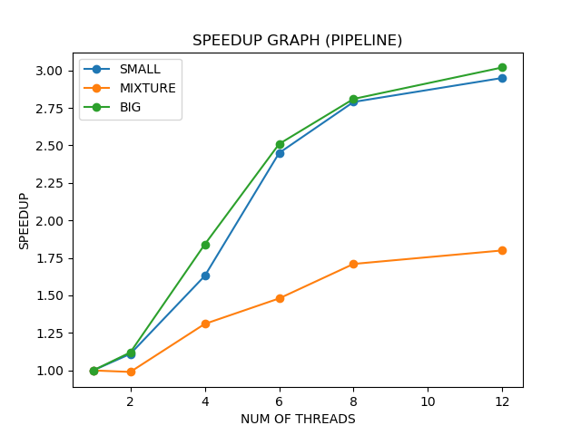
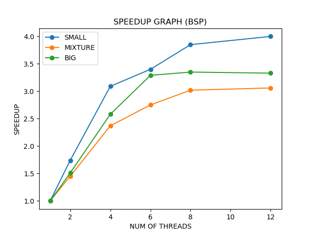

# Project 2 Report 

## A brief description of the project.

In this project we are given a set of images, each image has to be converted into a resultant image by applying a list of effects.

### Sequential Version :

For every size (small/mixture/large) effects.txt is read, based on the json the image is loaded and list of effects are applied. Once these effects are apllied the image is saved on a ouput path. After all the actions on an image are done, the next image is picked from effects.txt and applied effects.

### Pipeline Version :

* Here the task creater puts all the images into channel, the image is then read from the channel by the worker threads. One worker thread here is working on one image. 
* FanOut : This worker thread will now spawn multiple min-workers that will apply (all effects) effects on the bounds assigned to that mini-worker. The min-worker consume these bounds from a channel. Here channels are used to implement wait groups. 
* Once all the threads are done applying an effect we swap the image, to be ready for the next effect. This is an important step to wait for all the threads to apply an effect since otherwise there will be a race condition.
* The swap not done on the last effect. 
* The filtered image is now fed into a channel.
* FanIn (ResultAggregator) : All the images are saved in their output path. Here also for wait groups are implemented using channels.

### BSP Version:

* For BSP barrier `barrier.go` and semaphores `semaphore.go` are implemented.
* The Run BSP Worker implentation works differently based on the thread id.
* If the id is master id (in our case id = threadCount-1). The effects.txt is read, all the worker threads (num = threadCount-2) will work on this image.
* Here also in pipeline we will wait until all worker threads have applied one effect on their assigned bounds (bounds are assigned based on id).
* Once all the effects on an image is applied its pushed to an array.
* The master routine (threadCount-1) will then spawn new threads to save the images.
* In order to wait for threads barriers are used.

## Instructions on how to run your testing script. 

The sbatch script is inside 
`/home/toberoi/project-2-tinaoberoi/proj2/editor`
named 
`benchmark-proj2.sh`

In order to run the sbatch script 
`cd proj2/editor`
`sbathc benchmark-proj2.sh`

The results will be generated in data.txt file inside benchmark

## Explaination of graph results

- What are the hotspots and bottlenecks in your sequential program?

The folllowing are the bottlenecks and hotspots in sequential program:

* Although the images in the list `effects.txt` arent dependent on each other for actions, we are waiting for one image to finish to start another.

* Similarly, the rows in the images arent dependent on one another to apply effects, but still while doing sequentially we are waiting for one row to finish then doing another row.

* While the main go routine is saving, its waiting for image to be saved in the file before even it can start operation on another image.

- Which parallel implementation is performing better? Why do you think it is?

* The bsp with 12 threads is performing the best for me, of all the three sequential, pipeline, bsp. Although the speedup was even higher if I used max possible threads that is 128 on linux cluster.

In both pipeline and bsp I divided image into chunk and each go routine works on one chunk. Whereas in case of bsp I am spawning more go rotuines to save as well.
As a result of which my bsp is performing even faster.

- Does the problem size (i.e., the data size) affect performance?

Yes the problem size affects the amount of work each thread is doing. Compairing `big thread 4 ` and `small thread 4`, in case of small each thread has lower work as compared to the thread in big. The amount of work each thread has affects the time it takes to finish the work, thus affecting the performance.

- The Go runtime scheduler uses an N:M scheduler. However, how would the performance measurements be different if it used a 1:1 or N:1 scheduler?

The Go runtime scheduler uses an N:M scheduler, which means that M user-level threads are multiplexed onto N OS threads. This design provides several benefits such as efficient use of system resources, good performance in I/O bound and CPU-bound workloads, and good scalability on multi-core systems.

If the Go runtime scheduler used a 1:1 scheduler, where each user-level thread is mapped to one OS thread, performance measurements would be different. In this scenario, each user-level thread would require a dedicated OS thread, which could lead to high resource consumption and increased context switching overhead. This design could work well for small workloads with a limited number of threads but would not scale well for larger workloads.

On the other hand, if the Go runtime scheduler used an N:1 scheduler, where N user-level threads are mapped to one OS thread, performance measurements would also be different. In this scenario, all user-level threads would share one OS thread, which could lead to resource contention and increased blocking time. This design could work well for I/O bound workloads, but not for CPU-bound workloads.

In summary, the choice of scheduler design depends on the workload characteristics and the system resources available. The N:M scheduler used by the Go runtime provides a good balance between efficient resource utilization and good performance in various workloads.

## Based on the topics we discussed in class, identify the areas in your implementation that could hypothetically see increases in performance (if any). Explain why you would see those increases.

* The pipeline code can be imporved if I spwan go routines separately for saving as in case of bsp.

* At present we are spawning a fixed amount of worker threads, if increase the number of threads, amount of work each thread is doing will reduce as a result increasing the performance.

The performance achieved in case of 128 threads 

`sequential/bsp = 4.5`
`sequential/pipeline = 4.18`

Collaboration : Nishchay Karle

